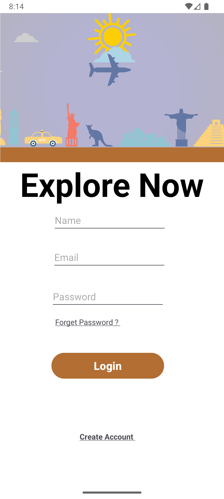
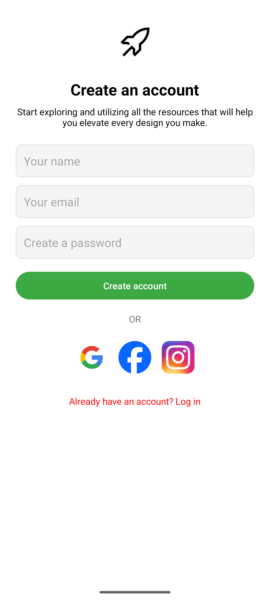
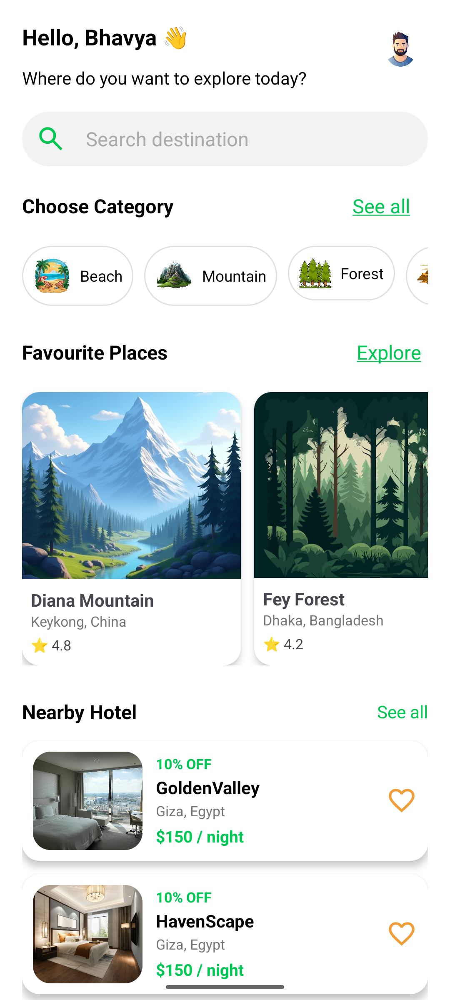
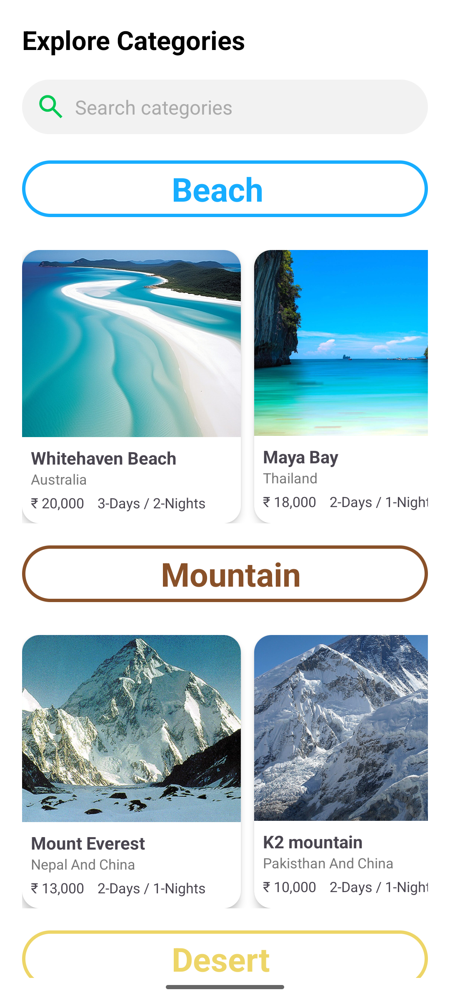
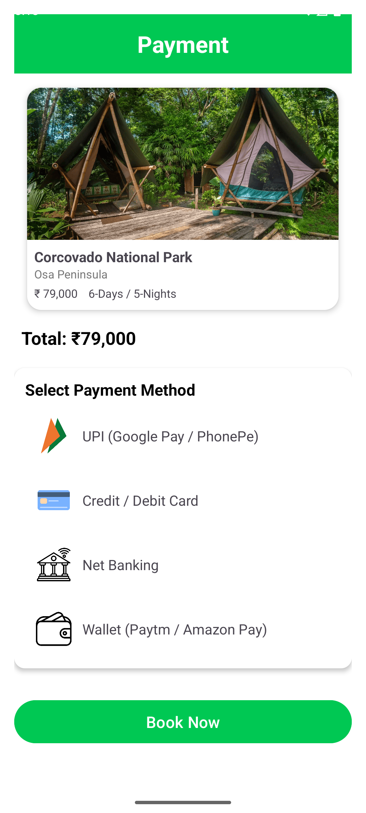
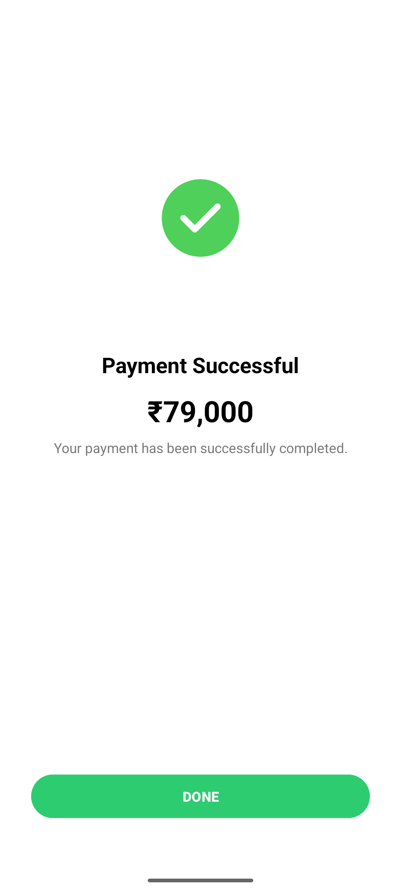
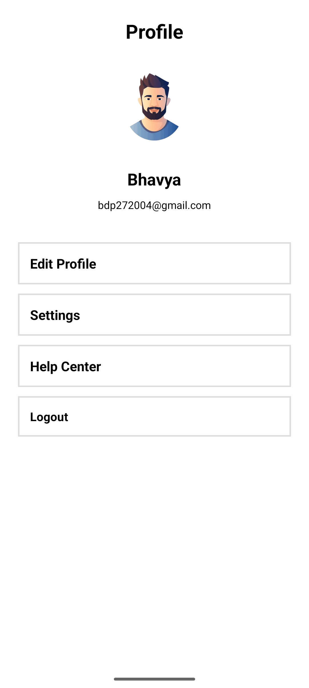

# 🌍 Explore Now – Android Travel UI App

Explore Now is a modern Android app built with **Kotlin** that lets users explore beautiful travel destinations with a clean and attractive UI.  
This project is perfect for learning Android UI, navigation, and layout design using **Android Studio**.

---

## ✨ Highlights

- 🎨 Clean and modern UI for travel/explore theme  
- 📱 Fully native **Android** project (Kotlin)  
- 🧭 Multiple screens to browse and view content  
- 🧩 Reusable components and layouts  
- 📷 Included screenshots for quick preview  

---

## 📸 App Screenshots

> _Screens are already in the repo, bas README ke saath show ho jayenge._

### 🔹 Main Screens

| Home / Intro | Explore Screen | Details Screen | Extra Screen |
|-------------|----------------|----------------|-------------|
|  |  |  |  |

### 🔹 More UI Screens

| Screen 5 | Screen 6 | Screen 7 | Screen 8 |
|----------|----------|----------|----------|
|  |  |  |  |

### 🔹 Additional Screen



---

## 🛠 Tech Stack

- **Language:** Kotlin  
- **IDE:** Android Studio  
- **Platform:** Native Android  
- **Build System:** Gradle (Kotlin DSL – `build.gradle.kts`)  

---

## 📂 Project Structure

```text
Explore_Now/
├── app/                # Main Android app module
│   ├── src/
│   │   ├── main/
│   │   │   ├── java/   # Kotlin source code (activities, adapters, etc.)
│   │   │   ├── res/    # Layout XMLs, drawables, colors, themes
│   │   │   └── AndroidManifest.xml
│   └── build.gradle.kts
├── gradle/             # Gradle wrapper
├── gradle.properties
├── settings.gradle.kts
├── Screenshot_1.png
├── Screenshot_2.png
├── Screenshot_3.png
├── Screenshot_4.png
├── Screenshot_5.png
├── Screenshot_6.png
├── Screenshot_7.png
├── Screenshot_8.png
└── Screenshot_9.png
